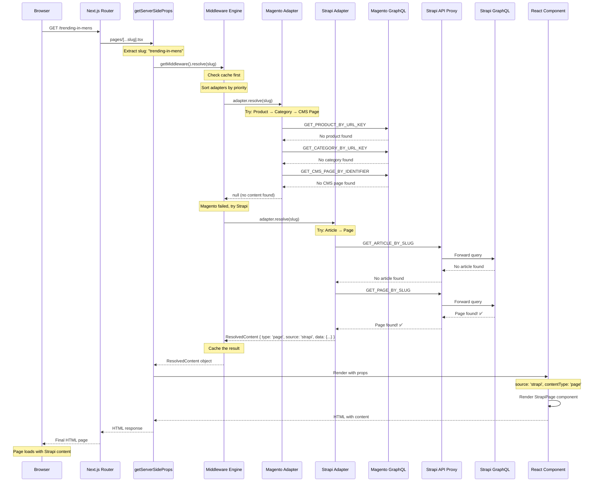

# 🔄 Request Flow Sequence Diagram

## Example: Request to `/trending-in-mens`



## 🔍 Detailed Step-by-Step Flow

### **Step 1: Browser Request**
```
Browser sends: GET http://localhost:3000/trending-in-mens
```

### **Step 2: Next.js Route Resolution**
```typescript
// pages/[...slug].tsx
const pathSegments = params?.slug as string[]; // ["trending-in-mens"]
const slug = pathSegments[pathSegments.length - 1]; // "trending-in-mens"
```

### **Step 3: Middleware Initialization**
```typescript
// getServerSideProps
const middleware = getMiddleware();
// Returns singleton instance with configured adapters:
// - MagentoAdapter(priority: 100)
// - StrapiAdapter(priority: 50)
```

### **Step 4: Cache Check**
```typescript
// Middleware checks cache first
const cached = this.getFromCache('trending-in-mens');
if (cached) return cached; // Cache miss, continue
```

### **Step 5: Adapter Priority Sorting**
```typescript
const enabledAdapters = [
  MagentoAdapter(100), // High priority - try first
  StrapiAdapter(50)    // Lower priority - try second
];
```

### **Step 6: Magento Adapter Attempt**
```typescript
// MagentoAdapter.resolve('trending-in-mens')
// Try in order:
// 1. GET_PRODUCT_BY_URL_KEY → No product found
// 2. GET_CATEGORY_BY_URL_KEY → No category found  
// 3. GET_CMS_PAGE_BY_IDENTIFIER → No CMS page found
// Result: null (no content found)
```

### **Step 7: Strapi Adapter Attempt**
```typescript
// StrapiAdapter.resolve('trending-in-mens')
// Try in order:
// 1. GET_ARTICLE_BY_SLUG → No article found
// 2. GET_PAGE_BY_SLUG → Page found! ✅
```

### **Step 8: GraphQL Query Execution**
```graphql
# Strapi GraphQL Query
query GetPage($slug: String!) {
  pages(filters: { slug: { eq: $slug } }) {
    documentId
    title
    slug
    seo { metaTitle, metaDescription }
    contentSections { ... }
  }
}
```

### **Step 9: Content Resolution**
```typescript
// Strapi returns page data
const resolvedContent = {
  type: 'page',
  source: 'strapi',
  data: {
    title: 'Trending in Mens',
    slug: 'trending-in-mens',
    contentSections: [...],
    seo: { metaTitle: 'Trending in Mens', metaDescription: '...' }
  },
  metadata: {
    title: 'Trending in Mens',
    description: 'Description about Trending in Mens'
  }
};
```

### **Step 10: Caching**
```typescript
// Middleware caches the result
this.setCache('trending-in-mens', resolvedContent);
// TTL: 5 minutes
```

### **Step 11: Props Generation**
```typescript
// Return to getServerSideProps
return {
  props: {
    content: resolvedContent.data,
    contentType: 'page',
    source: 'strapi',
    slug: 'trending-in-mens',
    metadata: resolvedContent.metadata
  }
};
```

### **Step 12: Component Rendering**
```typescript
// pages/[...slug].tsx
if (source === 'strapi' && contentType === 'page') {
  return (
    <DefaultLayout title="Trending in Mens" source="strapi">
      <StrapiPage slug="trending-in-mens" />
    </DefaultLayout>
  );
}
```

### **Step 13: Client-Side Hydration**
```typescript
// components/strapi/StrapiPage.tsx
export function StrapiPage({ slug }: StrapiPageProps) {
  const { page, loading, error } = useStrapiPage({ slug });
  // Additional client-side data fetching if needed
}
```

## 🎯 Key Decision Points

### **1. Cache Hit/Miss**
```typescript
if (cached && !isExpired(cached)) {
  return cached.data; // Skip all adapters
}
```

### **2. Adapter Priority**
```typescript
// Higher priority adapters tried first
MagentoAdapter(100) → StrapiAdapter(50) → FutureAdapter(25)
```

### **3. Circuit Breaker**
```typescript
if (this.isCircuitBreakerOpen(adapter.name)) {
  continue; // Skip failed adapter
}
```

### **4. Content Type Resolution**
```typescript
// Within each adapter, try different content types
Magento: Product → Category → CMS Page
Strapi: Article → Page
```

### **5. Error Handling**
```typescript
try {
  const result = await adapter.resolve(slug);
  if (result) return result;
} catch (error) {
  this.recordFailure(adapter.name); // Update circuit breaker
  continue; // Try next adapter
}
```

## 📊 Performance Metrics

### **Timing Breakdown (Typical)**
1. **Route Resolution**: ~1ms
2. **Middleware Init**: ~2ms
3. **Cache Check**: ~1ms
4. **Magento Adapter**: ~200ms (3 failed queries)
5. **Strapi Adapter**: ~150ms (1 successful query)
6. **Component Rendering**: ~50ms
7. **Total**: ~404ms

### **Optimization Opportunities**
- **Cache Hit**: Reduces total time to ~10ms
- **Circuit Breaker**: Skips failed adapters immediately
- **Parallel Queries**: Could run adapters concurrently
- **Static Generation**: Pre-render popular pages

## 🔄 Alternative Scenarios

### **Scenario 1: Magento Product Found**
```
MagentoAdapter → Product Query → Success → Return Product Content
(StrapiAdapter never called)
```

### **Scenario 2: Cache Hit**
```
Middleware → Cache Check → Hit → Return Cached Content
(No adapters called)
```

### **Scenario 3: All Adapters Fail**
```
MagentoAdapter → Fail → StrapiAdapter → Fail → Return 404
```

### **Scenario 4: Circuit Breaker Open**
```
MagentoAdapter → Circuit Breaker Open → Skip → StrapiAdapter → Success
```

This flow demonstrates the robust, fault-tolerant architecture that ensures content is always resolved efficiently, with proper fallbacks and performance optimizations at every step. 